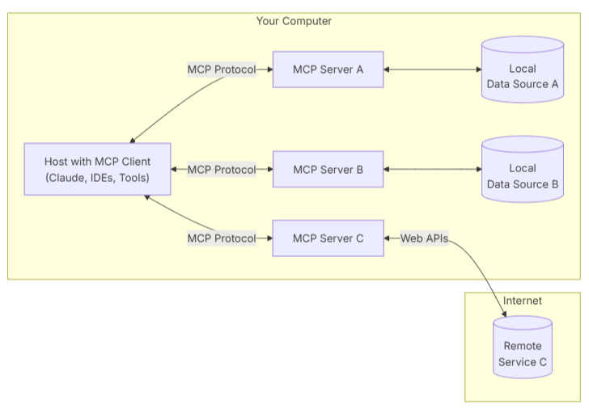
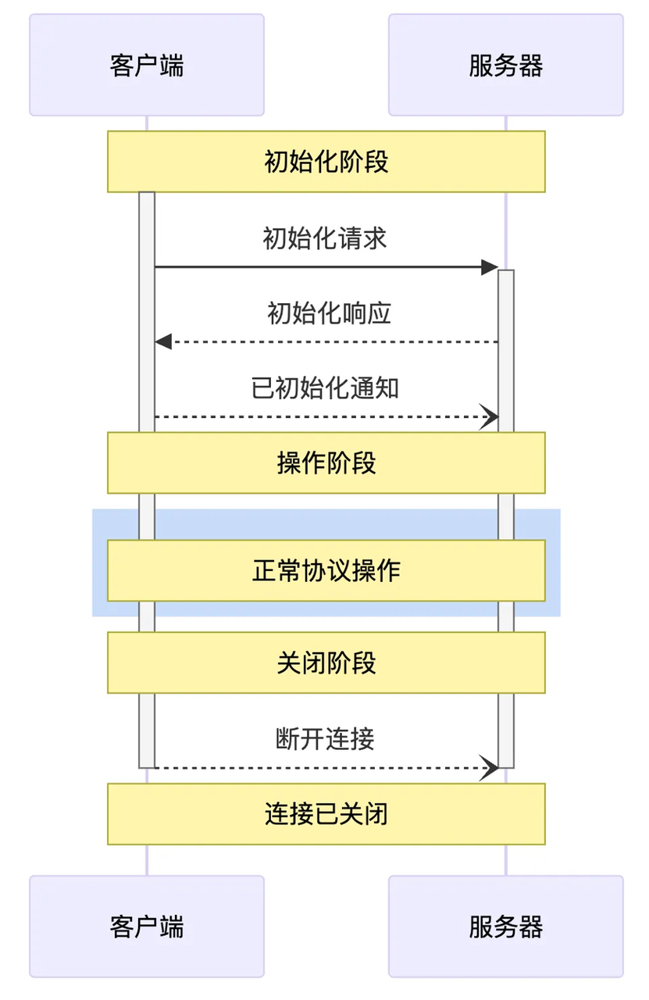
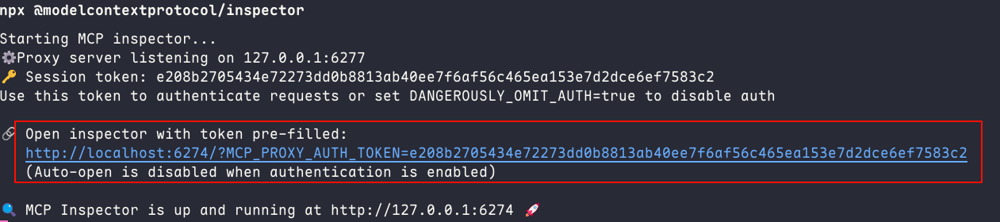
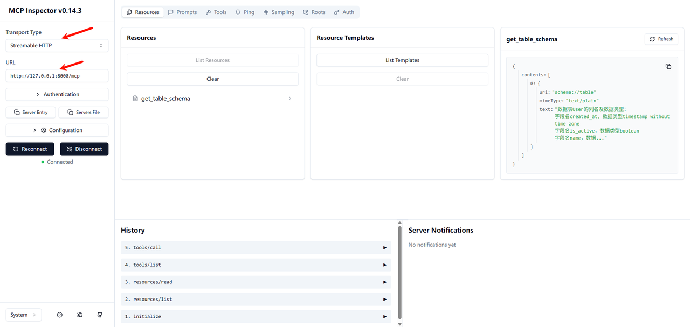
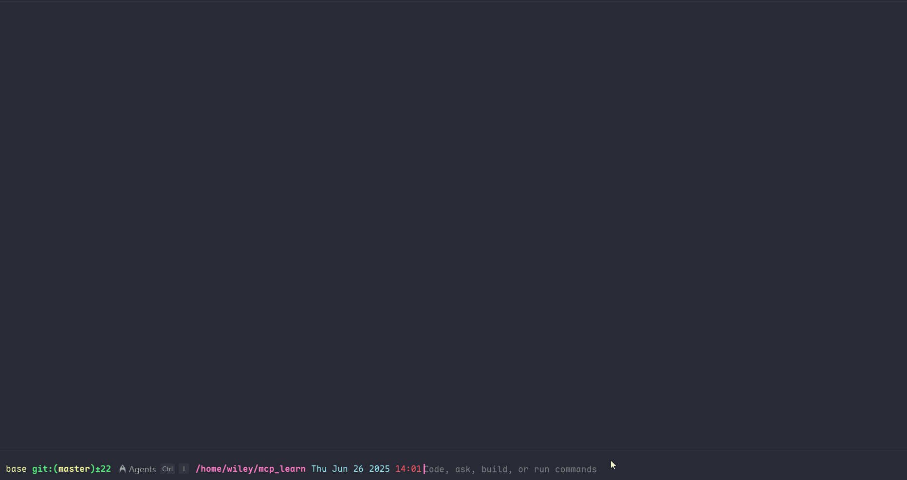
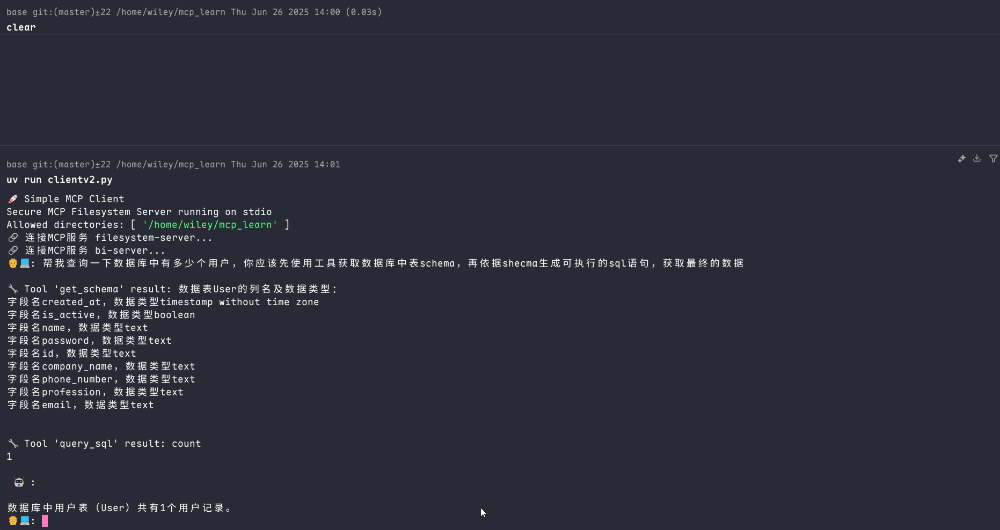

## MCP核心架构


MCP 采用了经典的 **Client-Server** 架构，各组件职责分明：




- MCP 主机 ：AI Agent，是发出指令的“大脑”。例如 Claude Desktop、Cursor或你自己的 AI 应用。
- MCP 客户端 ：通常内嵌于主机中，负责与服务器建立和维持连接，并处理协议层面的通信。
- MCP 服务器 ：**这是我们作为开发者主要构建的部分**。它是一个轻量级程序，封装了对特定功能的访问，如操作数据库、读写文件等。
- 本地数据源 ：服务器可以安全访问的本地资源，如计算机上的文件、数据库或服务。
- 远程服务 ：服务器可以通过 API 等方式连接的外部系统。

## MCP生命周期


MCP 的数据传输主要有两种方式，以适应不同的运行环境：

1. **stdio (标准输入/输出)**：客户端和服务器通过标准输入（stdin）和标准输出（stdout）进行通信。这种方式非常适合在同一台机器上运行的场景，例如，一个桌面 Agent 需要管理本地文件或控制浏览器，因为它简单、高效且无需网络配置。
2. **Streamable HTTP**: 客户端和服务器通过流式 HTTP 进行通信。这是更通用、更灵活的方式，适用于服务器与客户端分离部署的场景（如部署在 Docker 容器或云服务器上）。它具有更好的网络兼容性和可扩展性。




# 编写一个MCP Server


在开始之前，请确保你已经安装了必要的环境和库：

1. **Python 3.10+**
2. **PostgreSQL 数据库**：确保你有一个正在运行的数据库实例，并创建了相应的数据库和表（例如，一个名为 `db` 的库中有名为 `User` 的表）。
3. **安装依赖库**：

    ```plain text
    uv add psycopg 'mcp[cli]'
    ```


## 初始化MCP Server


```python
import psycopg

from mcp.server.fastmcp import FastMCP
from pydantic import Field

app = FastMCP("bi")
```


## Tool：定义一个可执行的动作


`Tool` 是客户端可以调用的函数，用于执行一个操作，比如查询数据库、发送消息或更新记录。它类似于 REST API 中的 `POST`请求。


`description` 参数至关重要，它会告诉 AI Agent这个工具是做什么的、什么时候该使用它，直接影响模型调用工具的准确性，使用类型标注与`pydantic`的`Field`描述参数。


```python
@app.tool(description="使用 SQL 语句查询数据。")
def query_sql(sql: str = Field(description="要执行的 SELECT SQL 语句")) -> str:
    if not sql:
        raise ValueError("缺少sql语句")
    with psycopg.connect("host=127.0.0.1 port=5432 dbname=db user=root password=123456") as db:
        with db.cursor() as acur:
            acur.execute(sql)
            if acur.description:
                columns = [desc[0] for desc in acur.description]
                formatted_rows = []
                for row in acur:
                    formatted_row = ["NULL" if value is None else str(value) for value in row]
                    formatted_rows.append(",".join(formatted_row))
                # 将列名和数据合并为CSV格式
                return "\n".join([",".join(columns)] + formatted_rows)
            return "没有查询到数据"
```


## Resource：暴露只读上下文信息


`Resource` 是服务器公开的只读数据或上下文，比如数据库的表结构、文件的元信息等。它类似于 REST API 中的 `GET` 请求。客户端通过一个唯一的 URI (`schema://table`) 来访问它。


```python
@app.resource("schema://table")
def get_table_schema() -> str:
    result = f"数据表User的列名及数据类型：\n"
    with psycopg.connect("host=127.0.0.1 port=5432 dbname=db user=root password=123456") as db:
        with db.cursor() as acur:
            acur.execute(f"SELECT column_name, data_type FROM information_schema.columns WHERE table_name = 'User';")
            for row in acur:
                result += f"字段名{row[0]}，数据类型{row[1]} \n"
            # 将列名和数据合并为CSV格式
            return result
```


## Prompt：提供预设的提示词模板


`Prompt` 是预定义的提示词模板，可以帮助用户或 Agent 更轻松地处理和格式化数据，减轻编写复杂提示词的负担。


```python
@app.prompt(name="to_echarts", description="将查询到的 CSV 数据整理为指定的 ECharts 图表。")
def prompt_echarts(chart_type: str = Field(description="图表类型, 例如 'bar', 'line', 'pie'")) -> str:
    """生成一个提示，要求 LLM 将数据转换为 ECharts HTML。"""
    return f"""
你是一个数据可视化专家。请将上面通过'query_sql'工具查询到的 CSV 格式数据，转换为一个使用 Apache ECharts 库实现的「{chart_type}」图表。

要求：
1. 生成一个完整的、可直接在浏览器中运行的 HTML 文件内容。
2. ECharts 库通过 CDN 方式引入 (https://cdn.jsdelivr.net/npm/echarts@5.5.0/dist/echarts.min.js)。
3. 根据 CSV 的列名和数据，智能地设置 `xAxis`, `yAxis`, 和 `series`。
4. 代码需要包含在 ```html ... ``` 代码块中。
"""
```


## 启动服务


采用streamable-http方式启动MCP Server


```python
if__name__ == '__main__':
    app.run(transport="streamable-http", mount_path="/mcp")
```


# 调试


MCP 官方提供了一个基于 Web 的调试工具，可以方便地查看和调用 Server 暴露的功能。

1. 确保已安装 Node.js 和 npm。
2. 在终端中运行以下命令：

```plain text
npx @modelcontextprotocol/inspector
```

1. 复制启动日志中的链接访问web ui，在输入框中填入你的 MCP Server 地址 (`http://127.0.0.1:8000/mcp`)，然后点击 "Connect"。







# 编写一个MCP Client


目前，生态中已经涌现出一些优秀的 MCP 应用，例如 Cursor, Cline, Warp, 和 Windsurf 等，你可以在 MCP 官方客户端列表(https://modelcontextprotocol.io/clients) 中看到它们的身影。


## 核心架构概览


在深入代码之前，我们先来了解一下客户端的整体架构。我们的客户端主要由两个核心类组成：

- **`Server`** **类**: 负责管理单个 MCP 服务的生命周期。它处理连接的建立、工具的列出、工具的执行以及连接的优雅关闭。每个 `Server` 实例对应一个配置好的 MCP 工具提供方。
- **`Client`** **类**: 整个客户端的总指挥。它管理着一个或多个 `Server` 实例，负责从所有服务中收集工具，将其整合后提供给 LLM，并协调用户、LLM 和工具之间的对话流程。

整个交互流程如下：

1. **启动与配置**: 客户端读取 `config.json` 文件，初始化所有在配置中定义的 MCP `Server`。
2. **连接与发现**: 客户端异步地连接到所有 MCP 服务，并请求每个服务提供其可用的工具列表。
3. **格式转换**: 由于 LLM（如 OpenAI API）的工具定义格式与 MCP 的原生格式不同，客户端需要进行一次转换，以便 LLM 能够“理解”这些工具。
4. **对话循环**:
    1. 用户输入问题。
    2. 客户端将对话历史和可用工具列表一起发送给 LLM。
    3. LLM 分析后，可能会选择直接回答，或者返回一个或多个工具调用（Tool Call）请求。
    4. 如果是工具调用，客户端会找到对应的 `Server` 并执行该工具。
    5. 工具的执行结果会被格式化后，再次发送给 LLM。
    6. LLM 根据工具结果，生成最终的自然语言回答。

## 实战代码


在运行代码前，请确保你已经安装了必要的 Python 库：


```plain text
uv add openai 'mcp[cli]'
```


配置文件`config.json`


```plain text
{
    "mcpServers": {
        "filesystem-server": {
            "command": "npx",
            "args": [
                "@modelcontextprotocol/server-filesystem",
                "/home/wiley/mcp_learn"
            ]
        },
        "bi-server": {
            "type": "streamable-http",
            "url": "http://127.0.0.1:8000/mcp"
        }
    }
}
```


## **配置解析**

- **`filesystem-server`** **服务**: 这是一个 `stdio` 类型的服务。
    - `command`: "npx" - 这意味着客户端会通过 `npx` 命令来启动这个工具服务。`stdio` 模式非常适合将本地命令行工具包装成 MCP 服务。
    - `args`: 传递给 `npx` 的参数。这里我们使用了一个社区提供的文件操作工具集。
- **`bi-server`** **服务**: 这是一个 `streamable-http` 类型的服务, 是我们上一讲的课程demo。
    - `type`: 指明连接类型。
    - `url`: 该服务监听的 HTTP 端点。这种类型适合连接网络上持续运行的 MCP 服务。

## 代码详解：一步步构建客户端


话不多说，先上完整代码，再一步步解释。


```python
import asyncio
import json
import logging
import os
import shutil
from contextlib import AsyncExitStack
from datetime import timedelta
from typing import Any

from mcp import Tool, StdioServerParameters, stdio_client
from openai import OpenAI

from mcp.client.session import ClientSession
from mcp.client.streamable_http import streamablehttp_client
from openai.types.chat import ChatCompletionMessageParam, ChatCompletionMessage

openai_client: OpenAI = OpenAI(api_key="123456", base_url="http://192.168.11.199:1282/v1")

def convert_mcp_to_openai_tools(mcp_tools: list) -> list:
    """将MCP Server返回的工具列表转换为OpenAI函数调用格式"""

    openai_tools = []

    for tool in mcp_tools:
        tool_schema = {
            "type": "function",
            "function": {
                "name": tool.name,
                "description": tool.description,
                "parameters": {}
            }
        }

        input_schema = tool.inputSchema

        parameters = {
            "type": input_schema['type'],
            "properties": input_schema['properties'],
            "required": input_schema['required'],
            "additionalProperties": False
        }
        for prop in parameters["properties"].values():
            # 特殊处理枚举值
            if "enum" in prop:
                prop["description"] = f"可选值: {', '.join(prop['enum'])}"

        tool_schema["function"]["parameters"] = parameters
        openai_tools.append(tool_schema)
    return openai_tools

class Server:
    """管理所有MCP Server的连接和工具执行"""

    def __init__(self, name: str, config: dict[str, Any]) -> None:
        self.name: str = name
        self.config: dict[str, Any] = config
        self.session: ClientSession | None = None
        self._cleanup_lock: asyncio.Lock = asyncio.Lock()
        self.exit_stack: AsyncExitStack = AsyncExitStack()

    async def initialize(self) -> None:
        """初始化所有 MCP Server"""
        try:
            # streamable-http 方式
            if "type" in self.config and self.config["type"] == "streamable-http":
                streamable_http_transport = await self.exit_stack.enter_async_context(
                    streamablehttp_client(
                        url=self.config["url"],
                        timeout=timedelta(seconds=60)
                    )
                )
                read_stream, write_stream, _ = streamable_http_transport
                session = await self.exit_stack.enter_async_context(
                    ClientSession(read_stream, write_stream)
                )
                await session.initialize()
                self.session = session
            # stdio 方式
            if "command" in self.config and self.config["command"]:
                command = (
                    shutil.which("npx")
                    if self.config["command"] == "npx"
                    else self.config["command"]
                )
                server_params = StdioServerParameters(
                    command=command,
                    args=self.config["args"],
                    env={**os.environ, **self.config["env"]}
                    if self.config.get("env")
                    else None,
                )
                stdio_transport = await self.exit_stack.enter_async_context(
                    stdio_client(server_params)
                )
                read, write = stdio_transport
                session = await self.exit_stack.enter_async_context(
                    ClientSession(read, write)
                )
                await session.initialize()
                self.session = session
            print(f"🔗 连接MCP服务 {self.name}...")
        except Exception as e:
            logging.error(f"❌ 初始化错误 {self.name}: {e}")
            await self.cleanup()
            raise

    async def list_tools(self) -> list[Tool]:
        """从MCP Server列出所有工具"""
        if not self.session:
            raise RuntimeError(f"Server {self.name} not initialized")

        tools_response = await self.session.list_tools()
        return tools_response.tools

    async def execute_tool(
        self,
        tool_name: str,
        arguments: str,
        retries: int = 2,
        delay: float = 1.0,
    ) -> str | None:
        """执行工具"""
        if not self.session:
            raise RuntimeError(f"Server {self.name} not initialized")
        arguments = json.loads(arguments) if arguments else {}
        attempt = 0
        while attempt < retries:
            try:
                logging.info(f"Executing {tool_name}...")
                result = await self.session.call_tool(tool_name, arguments)
                if result.isError:
                    print(f"Tool error: {result.error}")
                print(f"\n🔧 Tool '{tool_name}' result: {result.content[0].text}")
                return result.content[0].text
            except Exception as e:
                attempt += 1
                logging.warning(
                    f"Error executing tool: {e}. Attempt {attempt} of {retries}."
                )
                if attempt < retries:
                    logging.info(f"Retrying in {delay} seconds...")
                    await asyncio.sleep(delay)
                else:
                    logging.error("Max retries reached. Failing.")
                    raise
        return None

    async def cleanup(self) -> None:
        async with self._cleanup_lock:
            try:
                await self.exit_stack.aclose()
                self.session = None
            except Exception as e:
                logging.error(f"Error during cleanup of server {self.name}: {e}")


class Client:

    def __init__(self, servers: list[Server]):
        self.servers: list[Server] = servers
        self.openai_tools: list[dict] = []

    async def cleanup_servers(self) -> None:
        for server in reversed(self.servers):
            try:
                await server.cleanup()
            except Exception as e:
                logging.warning(f"Warning during final cleanup: {e}")

    async def get_response(self, messages: list[ChatCompletionMessageParam]) -> ChatCompletionMessage | None:
        """提交LLM，并获取响应"""
        try:
            completion = openai_client.chat.completions.create(
                model="qwen3_32",
                messages=messages,
                tools=self.openai_tools,
                tool_choice="auto"
            )
            return completion.choices[0].message

        except Exception as e:
            error_message = f"Error getting LLM response: {str(e)}"
            logging.error(error_message)
            return None


    async def start(self):
        """开始MCP Client"""
        for server in self.servers:
            try:
                await server.initialize()
            except Exception as e:
                logging.error(f"Failed to initialize server: {e}")
                await self.cleanup_servers()
                return
        all_tools = []
        for server in self.servers:
            tools = await server.list_tools()
            all_tools.extend(tools)
        # 将所有工具转为openai格式
        self.openai_tools = convert_mcp_to_openai_tools(all_tools)
        await self.chat_loop()

    async def run(self, messages: list[Any], tool_call_count: int = 0, max_tools: int = 5):
        """获取LLM响应"""
        if tool_call_count > max_tools:
            # 强制结束并返回提示信息
            return messages.append({
                "role": "assistant",
                "content": "已达到最大工具调用次数限制"
            })
        tool_call_count += 1
        llm_response = await self.get_response(messages)
        result = await self.process_llm_response(llm_response)
        messages.append(result)
        if result["role"] == "tool":
            await self.run(messages, tool_call_count)
        return messages

    async def chat_loop(self):
        system_message = (
            "你是一个帮助人的AI助手。"
        )
        messages = [{"role": "system", "content": system_message}]
        while True:
            try:
                user_input = input("👨‍💻: ").strip().lower()
                if user_input in ["quit"]:
                    logging.info("\nExiting...")
                    break
                messages.append({"role": "user", "content": user_input})
                result = await self.run(messages)
                reply = result[-1]["content"]
                print(f"\n 🤖 : {reply}")
            except KeyboardInterrupt:
                print("\n\n👋 Goodbye!")
                break
            except EOFError:
                break

    async def process_llm_response(self, llm_response: ChatCompletionMessage) -> dict:
        """"""
        tool_call = llm_response.tool_calls
        if tool_call:
            tool_call = tool_call[0].function
            logging.info(f"Executing tool: {tool_call.name}")
            logging.info(f"With arguments: {tool_call.arguments}")
            for server in self.servers:
                tools = await server.list_tools()
                if any(tool.name == tool_call.name for tool in tools):
                    try:
                        result = await server.execute_tool(tool_call.name, tool_call.arguments)
                        logging.info(f"Tool execution result: {result}")
                        return {"role": "tool", "content": result}
                    except Exception as e:
                        error_msg = f"Error executing tool: {str(e)}"
                        logging.error(error_msg)
        return {"role": "assistant", "content": llm_response.content}


async def main():
    # 读取mcp server配置文件
    with open("config.json", "r") as f:
        config = json.load(f)
    servers = [
        Server(name, srv_config)
        for name, srv_config in config["mcpServers"].items()
    ]
    print("🚀 Simple MCP Client")
    client = Client(servers)
    await client.start()


def cli():
    """CLI entry point for uv script."""
    asyncio.run(main())


if __name__ == "__main__":
    cli()
```


## 关键代码段解析

1. **`convert_mcp_to_openai_tools`** **函数**:
    1. **作用**: 这是连接 MCP 生态和 OpenAI API 生态的桥梁。此函数就是做个简单的转换。
2. **`Server.initialize`****方法**:
    1. **核心功能**: 这是连接逻辑的所在。它通过判断 `config` 中的 `type` 或 `command` 字段来决定使用 `streamable-http` 还是 `stdio` 连接方式。
    2. **资源管理**: 这里使用了 `contextlib.AsyncExitStack`。它是一个异步的退出栈，可以确保我们进入的每一个异步上下文（比如 `stdio_client` 和 `ClientSession`）在 `Server` 生命周期结束时，都会被正确地、按相反的顺序关闭。这极大地增强了程序的健壮性，避免了资源泄露。
3. **`Server.list_tools`****方法**:
    1. **获取所有工具：**使用mcp sdk提供的`session.list_tools()`获取当前服务的工具
4. **`Server.execute_tool`****方法**:
    1. **执行工具调用：**使用mcp sdk提供的`session.call_tool`调用指定工具，这里增加了重试次数
5. **`Client.get_response`**:
    1. **调用LLM：**接收用户消息和工具列表，与LLM通信
6. **`Client.start`**:
    1. **初始化MCP Server：**并获取所有工具，准备启动聊天
7. **`Client.chat_loop`**:
    1. **用户输入:** 启动聊天循环，接收用户简单的退出指令。
8. **`Client.run`**:
    1. **多轮工具调用**: **`run`**方法通过一个递归，支持模型进行连续的工具调用（例如，先搜索信息，再根据信息写入文件），直到它认为任务完成或者达到最大调用次数限制。
9. **`Client.process_llm_response`**:
    1. **处理LLM响应**: 如果模型返回的消息为工具调用，则执行`execute_tool`方法执行调用，否则直接回答用户。

# 本地测试


调用**`bi-server`**服务，获取数据库中的记录





调用**`filesystem-server`**服务，查询数据用户信息，并写入本地文件




