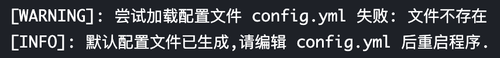
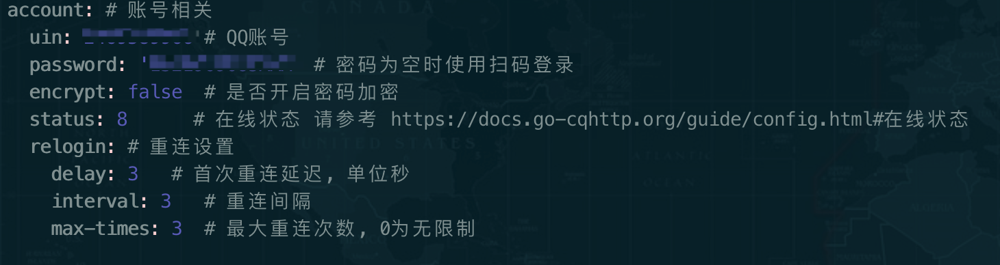
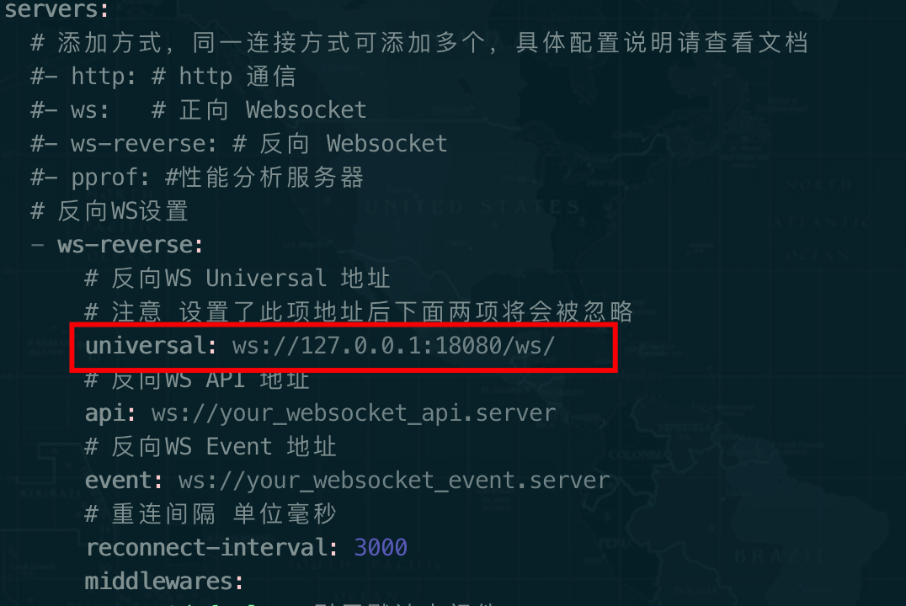
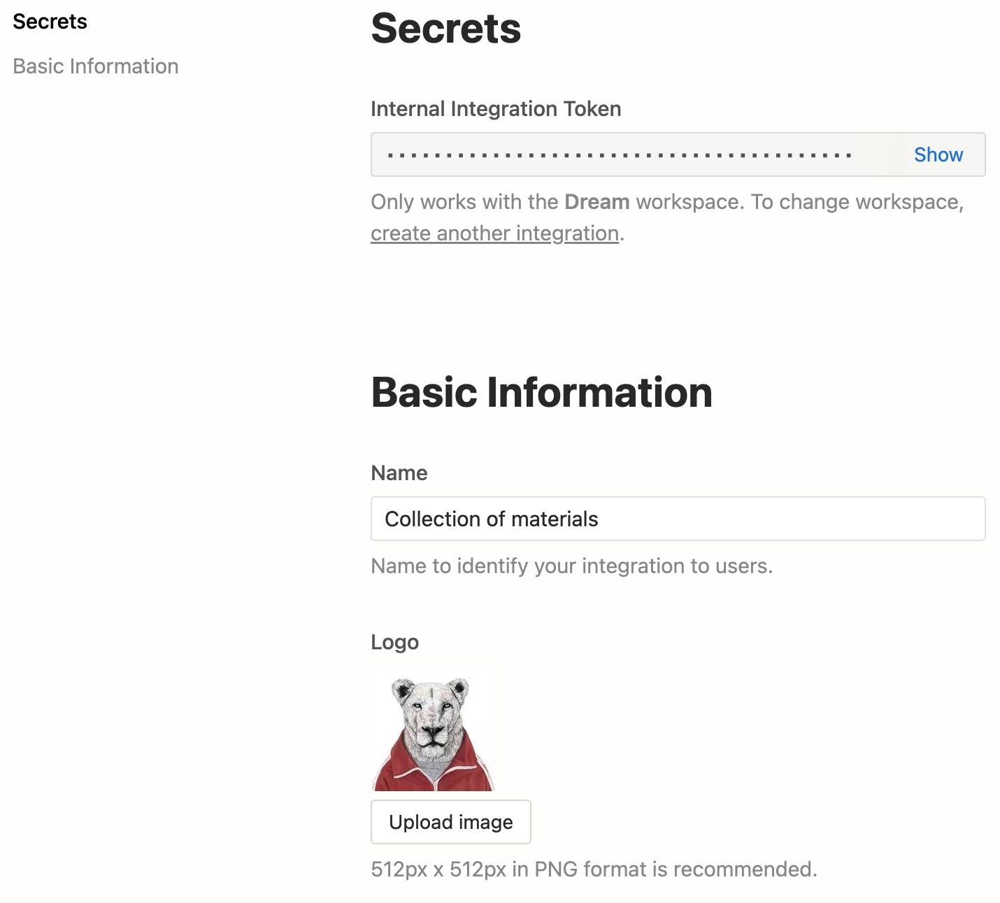
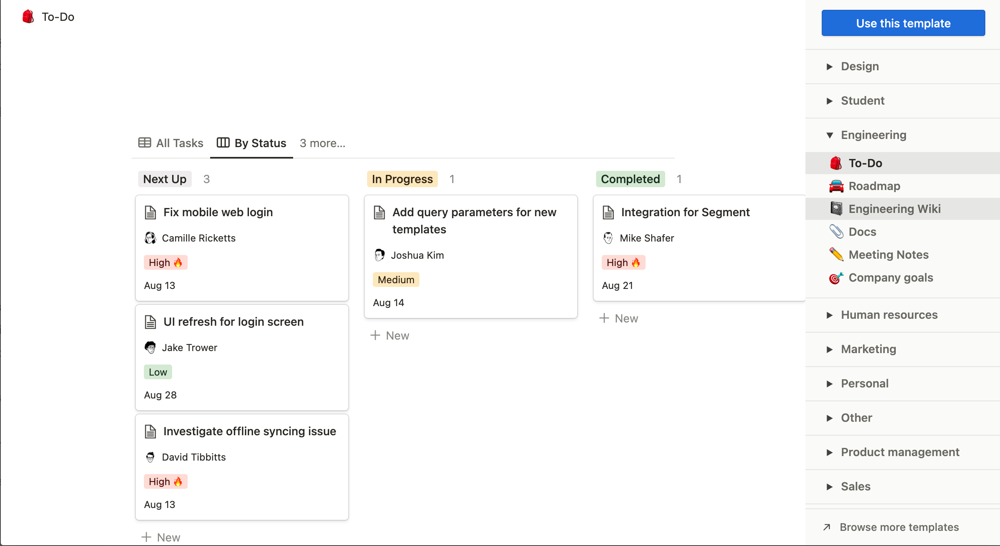
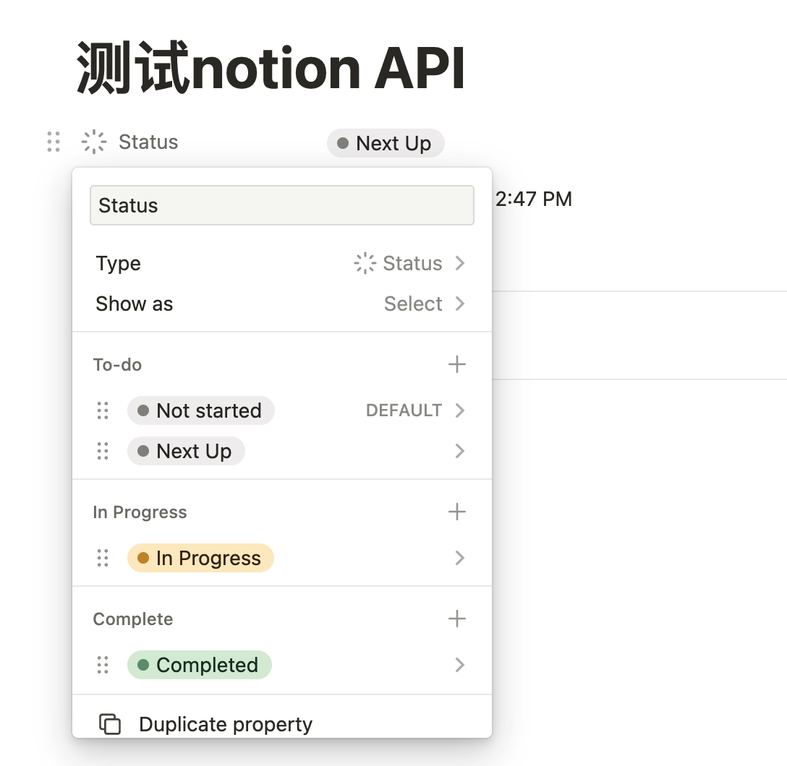
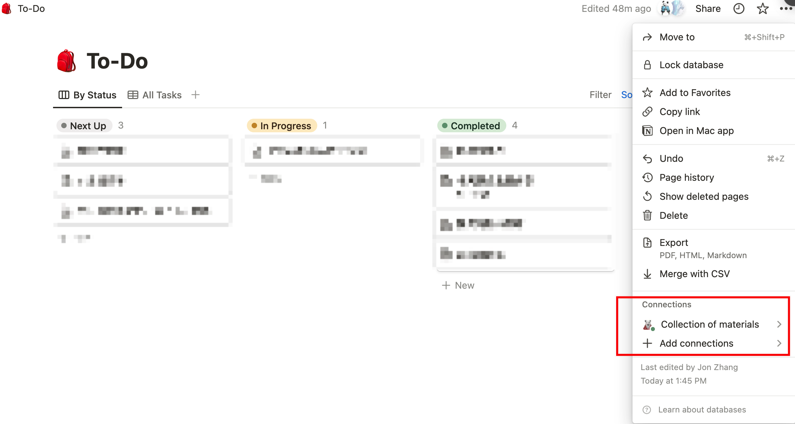
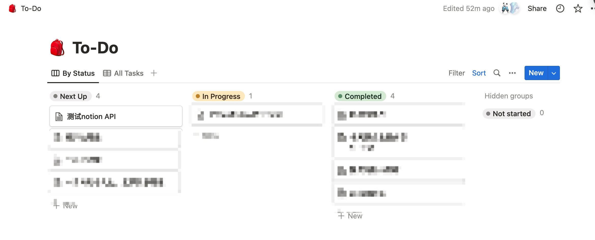

习惯在QQ置顶一个小号，用于“随手记”。可能是某一时刻的想法，或者是链接等，每天早晨都会看之前的随手记，有些可以看到就做。还有一些是flag，当前可能做不了，需要稍后的，QQ查看之前的聊天的记录，已完成未完成混杂在一起，查看起来有些麻烦。随着notion开放API，便想到了使用QQ或wechat输入（这个两个app每天打开无数次），notion收集。经过研究，wechat接入第三方应用非常的麻烦，可行性太低。QQ则可以借助各种qq bot工具实现第三方的接入。因此我便使用[cqhttp](https://github.com/nonebot/aiocqhttp)+python脚本实现自己的收集工具，具体过程如下(在腾讯云服务器实现)


# [cqhttp](https://github.com/Mrs4s/go-cqhttp)

1. 在[github](https://github.com/Mrs4s/go-cqhttp/releases)下载合适的安装包到本地机器，并解压 支持win，linux，macos
2. 首次执行`./go-cqhttp`，生成配置文件config.yml

    

3. 修改config.yml ,配置账户和密码。记住下面的servers的链接端口。更新详细的[配置参考官方](https://docs.go-cqhttp.org/guide/config.html#%E9%85%8D%E7%BD%AE%E4%BF%A1%E6%81%AF)

    


    

4. 再次使用`./go-cqhttp`启动，可能会展示二维码，需要使用手机扫描验证后即可登录。`ctrl+c`终止掉程序
5. 使用命令后台运行`nohup ./go-cqhttp &`

# python脚本与cq通讯


python环境的安装不在赘述。这里使用python sdk `aiocqhttp`[官网](https://aiocqhttp.nonebot.dev/#/getting-started)

1. 安装包`pip install aiocqhttp`
2. 执行最小的demo，查看链接状况

    ```javascript
    from aiocqhttp import CQHttp, Event
    
    bot = CQHttp()
    
    
    @bot.on_message('private')
    async def _(event: Event):
        await bot.send(event, '你发了：')
        return {'reply': event.message}
    
    
    bot.run(host='127.0.0.1', port=18080)
    ```

3. 这个时候使用其他的账号给小号发送消息，即可收到小号的回复

# python脚本调用notionAPI

1. 创建[notion集成工具](https://www.notion.so/my-integrations)

    填写name，为工具取名，我这里取名`Collection of materials`，以及设置访问权限后，保存。即可看到访问token


    

2. 创建notion页面，使用模板库的todo。按自己需求修改

    


    我这里修改Status为Status类型，保留创建时间属性，其他删除。这里的属性关乎API中的数据结构的组装


    

3. 给todo页面 选择刚才创建的连接工具

    

4. 编写py代码，验证集成工具的可用性。关于notion的数据结构，参考[官方文档](https://developers.notion.com/reference/intro)

    ```python
    import asyncio
    
    import httpx
    
    
    class NotionApi:
        NOTION_KEY = '' # 此处填写集成工具的token
        database_id = '' # 此处填写database页面的id，可在todo页面的url中找到
    
        def __init__(self):
            self.url = f"https://api.notion.com/v1/pages" # api地址，可在文档中找到
            self.headers = {
                "Accept": "application/json",
                "Notion-Version": "2021-08-16",
                "Authorization": f"Bearer {self.NOTION_KEY}"
            }
    
        async def insert_page(self, content: str) -> str:
            # database属性
            properties = {
                "Name": {
                    "title": [
                        {
                            "type": "text",
                            "text": {
                                "content": f"{content[0:14]}" # 截取前14个字符为page的标题
                            }
                        }
                    ]
                },
                "Status": {
                    "status": {
                        "name": "Next Up"
                    }
                }
            }
            # 页面内容
            children = [{
                "object": "block",
                "type": "paragraph",
                "paragraph": {
                    "text": [{"type": "text", "text": {"content": content}}]
                }
            }]
            # database 信息
            parent = {"type": "database_id", "database_id": self.database_id}
            data = {
                "parent": parent,
                "properties": properties,
                "children": children
            }
            async with httpx.AsyncClient() as client:
                r = await client.post(url=self.url, headers=self.headers, json=data)
                print(r.text)
                if r.status_code == 200:
                    return "收集成功!"
                else:
                    return "收集失败!"
    
    
    notion_database = NotionApi()
    
    if __name__ == '__main__':
        asyncio.run(notion_database.insert_page("测试notion API"))
    ```


    注意：

        1. 我们刚才创建的todo页面其实是一个database
        2. 我们要创建的各个todo其实是database下面的page
        3. 因此我们使用的api 是[创建page](https://developers.notion.com/reference/post-page)
5. 正常情况下，已经执行成功，可在todo页面看到

    

6. 完整代码（bot.py）如下，在服务器执行`nohup python -u bot.py > bot.log 2>&1 &`

    ```python
    # -*- coding:utf-8 -*-
    from aiocqhttp import CQHttp, Event
    
    from action import sent
    
    import httpx
    
    
    class NotionApi:
        NOTION_KEY = ''
        database_id = ''
    
        def __init__(self):
            self.url = f"https://api.notion.com/v1/pages"
            self.headers = {
                "Accept": "application/json",
                "Notion-Version": "2021-08-16",
                "Authorization": f"Bearer {self.NOTION_KEY}"
            }
    
        async def insert_page(self, content: str) -> str:
            # database属性
            properties = {
                "Name": {
                    "title": [
                        {
                            "type": "text",
                            "text": {
                                "content": f"{content[0:14]}"
                            }
                        }
                    ]
                },
                "Status": {
                    "status": {
                        "name": "Next Up"
                    }
                }
            }
            # 页面内容
            children = [{
                "object": "block",
                "type": "paragraph",
                "paragraph": {
                    "text": [{"type": "text", "text": {"content": content}}]
                }
            }]
            # database 信息
            parent = {"type": "database_id", "database_id": self.database_id}
            data = {
                "parent": parent,
                "properties": properties,
                "children": children
            }
            async with httpx.AsyncClient() as client:
                r = await client.post(url=self.url, headers=self.headers, json=data)
                print(r.text)
                if r.status_code == 200:
                    return "收集成功!"
                else:
                    return "收集失败!"
    
    
    notion_database = NotionApi()
    
    bot = CQHttp()
    
    
    @bot.on_message('private')
    async def _(event: Event):
        n = await sent(notion_database.insert_page(event.message))
        await bot.send(event, n)
    
    
    bot.run(host='127.0.0.1', port=18080)
    ```


# 总结


整个过程中的难点是对notion API的理解，一开始以为添加todo是create a database，几经尝试后才搞清楚关系，这一点需要注意。其次是api 数据结构的组装，需要多查看[文档](https://developers.notion.com/reference/property-value-object)

