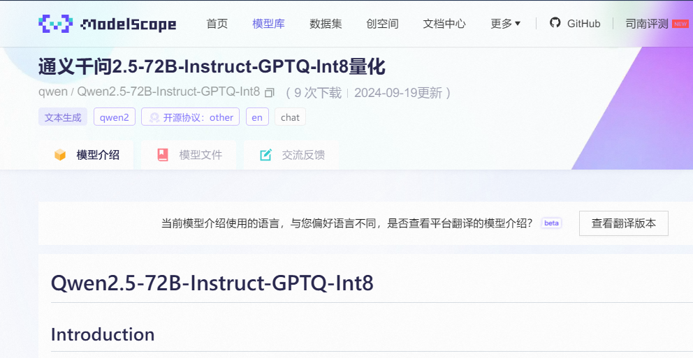
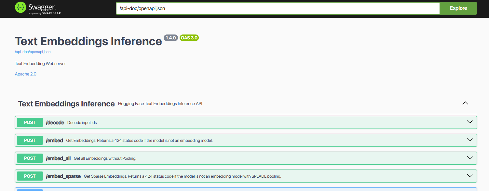
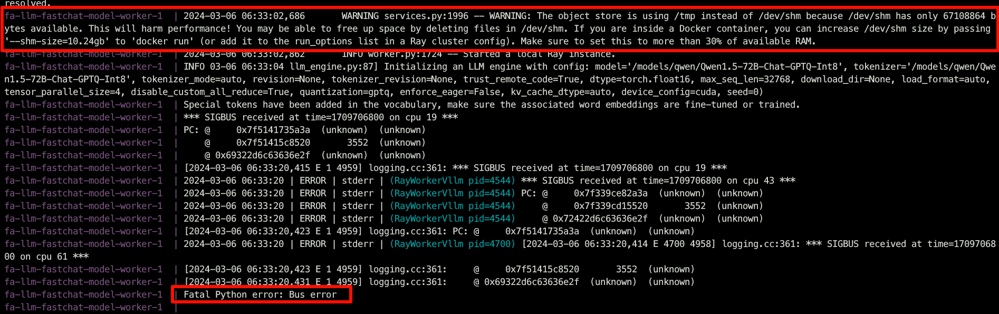
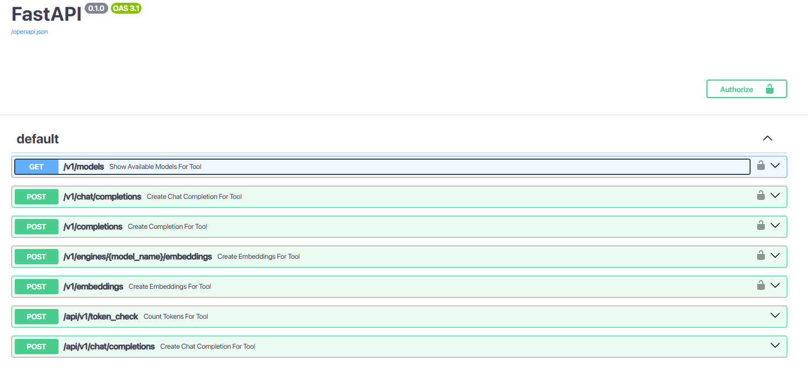

# 模型选择


LLM模型，Embedding模型选择参考下面的文章


[link_to_page](https://www.wileyzhang.com/posts/4ab81ed7-7622-4ef1-9fc6-1e1ae4edbd99)


# 模型下载


当前提供模型的网站主要有[ModelScope](https://www.modelscope.cn/models)和[HuggingFace](https://huggingface.co/models)，下载方式主要是git lfs和平台封装两种方法


## ModelScope

1. 安装modelscope

    ```shell
    pip install modelscope
    ```

2. 复制模型名称

    

3. 下载模型到指定目录

    ```shell
    #模型下载
    from modelscope import snapshot_download
    # 注意替换模型名称，不指定目录，则默认下载到用户目录.cache/modelscope/
    model_dir = snapshot_download('qwen/Qwen2.5-72B-Instruct-GPTQ-Int8', cache_dir='/data/models/')
    ```


# 模型部署


## LLM、Embedding、Rerank docker部署

1. 安装docker，国内使用[清华开源软件镜像站](https://mirror.tuna.tsinghua.edu.cn/help/docker-ce/)
2. [安装](https://docs.nvidia.com/datacenter/cloud-native/container-toolkit/latest/install-guide.html)[**NVIDIA Container Toolkit**](https://docs.nvidia.com/datacenter/cloud-native/container-toolkit/latest/install-guide.html)
3. 使用docker compose 部署，部署文件见下面的github地址

    [bookmark](https://github.com/bluechanel/deploy_llm/tree/main)

4. clone 项目

    ```json
    git clone git@github.com:bluechanel/deploy_llm.git
    cd deploy_llm
    ```

5. 修改模型保存目录

    ```yaml
    x-vllm-common:
      &common
      image: vllm/vllm-openai:latest
      restart: unless-stopped
      environment:
        TZ: "Asia/Shanghai"
      volumes:
        - /data/models:/models # 此处修改为实际模型目录。
      networks:
        - vllm
    ```

6. 修改模型启动参数

    vllm的更多参数见[vllm文档](https://docs.vllm.ai/en/stable/serving/openai_compatible_server.html#cli-reference)

    1. LLM

        修改command 里面的 `—-model` 后面的模型目录，映射到docker中的目录


        ```yaml
        command: [ "--model","/models/{你的模型目录}",  "--enable-prefix-caching","--host", "0.0.0.0", "--port", "8000", "--served-model-name", "gpt-4", "--distributed-executor-backend","ray","--tensor-parallel-size","2","--pipeline-parallel-size", "1","--enable-reasoning","--reasoning-parser","deepseek_r1"]
        ```


        这里有几个常用参数说明


        `--served-model-name`：模型调用名称，可以自定义填写任意名称


        `--tensor-parallel-size`：并行数量，取决于使用的显卡数量
        `--enable-prefix-caching`：开启前缀缓存，对多轮对话有一定效率提升


        `"--enable-reasoning", "--reasoning-parser","deepseek_r1"` 如果是推理模型，可以配置该参数，目前支持`deepseek_r1`系列


        `"--enable-auto-tool-choice", "--tool-call-parser", "hermes”`：开启工具调用能力，例如Qwen2.5 系列模型，参考


        ```yaml
        command: [ "--model","/models/qwen/Qwen2___5-72B-Instruct-GPTQ-Int8", "--enable-prefix-caching", "--host", "0.0.0.0", "--port", "8000", "--served-model-name", "gpt-4", "--enable-auto-tool-choice", "--tool-call-parser", "hermes","--distributed-executor-backend","ray","--tensor-parallel-size","2","--pipeline-parallel-size", "1" ]
        ```

    2. Embedding

        修改command 里面的 `—-model` 后面的模型目录为映射到docker中的embedding模型目录


        ```yaml
        command: [ "--model","/models/{你的模型目录}",  "--host", "0.0.0.0", "--port", "8000", "--task", "embed", "--served-model-name", "gte-large-zh"]
        ```

    3. Rerank

        修改command 里面的 `—-model` 后面的模型目录为映射到docker中的reranker模型目录


        ```yaml
        command: [ "--model","/models/{你的模型目录}",  "--host", "0.0.0.0", "--port", "8000", "--task", "score", "--served-model-name", "bge-reranker-base"]
        ```

7. 使用docker compose 启动模型

    ```json
    docker compose up -d
    ```


    模型启动后，docker对外暴露在8000端口，访问`http://ip:8000/docs`查看接口文档

8. 测试，使用demo脚本测试。注意修改 各模型的自定义名称

    ```json
    python demo.py
    ```


## LLM、embedding、reranker分体部署

# LLM部署

1. clone 项目，并进入llm目录

    ```shell
    git clone https://github.com/bluechanel/deploy_llm.git
    cd deploy_llm/llm
    ```

2. 修改模型映射路径，`vim docker-compose.yaml`

    ```shell
    x-common:
      &common
      volumes:
      # 修改为自己下载模型的地址映射到容器/models
        - 
    /data/models:/models
    
      environment:
      # 时区设置
        &common-env
        TZ: "Asia/Shanghai"
    ```


    修改模型启动命令，在vllm服务中，修改`--served-model-name` 为自定义模型名称   `--model`为修改后的模型路径，`--tensor-parallel-size 4`为使用显卡数量，根据实际情况修改


    ```shell
    command: [ "--model","/models/qwen/Qwen2___5-72B-Instruct-GPTQ-Int8",  "--host", "0.0.0.0", "--port", "8000", "--served-model-name", "gpt-4", "--enable-auto-tool-choice", "--tool-call-parser", "hermes","--distributed-executor-backend","ray","--tensor-parallel-size","4","--pipeline-parallel-size", "1" ]
    ```

3. 启动`docker compose up -d`
4. 查看api文档`http://ip:1281/docs`

## Embedding+Rerank部署


> 💡 embedding 和 rerank是两个模型，可直接在modelscope搜索rerank找相关模型

1. 进入embedding目录
2. 修改模型映射路径，`vim docker-compose.yaml`

    ```shell
    x-common:
      &common
      volumes:
      # 修改为自己下载模型的地址映射到容器/models
        - 
    /data/models:/models
    
      environment:
      # 时区设置
        &common-env
        TZ: "Asia/Shanghai"
    ```


    修改embedding启动命令，修改`--model-id`为修改后的模型路径


    ```shell
    command: [ "--json-output", "--model-id", "/models/maple77/gte-large-zh"]
    ```

3. 启动`docker compose up -d`
4. 查看api文档embedding: `http://ip:1282/docs` rerank:`http://ip:1283/docs`

    


**排错**


vllm启动可能会有如下报错，在docker compose中修改`shm_size`的值为错误提示的值，即可





## 已废弃部署方法（20240918）

# 模型部署


当前开源的模型部署服务很多，主流的有[FastChat、](https://github.com/lm-sys/FastChat)[Xinference](https://github.com/xorbitsai/inference)、[ollama](https://github.com/ollama/ollama)、[vllm](https://github.com/vllm-project/vllm)、[lightllm](https://github.com/ModelTC/lightllm)，其中vllm，lightllm主要是用于**模型加速**。同时FastChat等也支持使用vllm启动模型获得高效加速，不过这些部署服务都**不支持工具调用**，也就是OpenAI 接口的tools参数。遂我对FastChat的代码做了部分修改，使其**支持tools参数。**具体代码见github，（仅测试了Qwen系列）


> 💡 由于不同模型训练数据不同，同样的Prompt在不同的模型中结果差异较大，导致tools能力不稳定，该能力未提交FastChat原始仓库。


[bookmark](https://github.com/bluechanel/FastChat/tree/main)


推荐的部署方案为：FastChat+vllm


## 方案1：docker部署(推荐)

1. 安装docker，国内使用[清华开源软件镜像站](https://mirror.tuna.tsinghua.edu.cn/help/docker-ce/)
2. [安装](https://docs.nvidia.com/datacenter/cloud-native/container-toolkit/latest/install-guide.html)[**NVIDIA Container Toolkit**](https://docs.nvidia.com/datacenter/cloud-native/container-toolkit/latest/install-guide.html)
3. 使用docker compose 部署，部署文件见下面的github地址

    [bookmark](https://github.com/bluechanel/deploy_llm/tree/main)


### LLM部署

1. clone 项目，并进入llm目录

    ```shell
    git clone https://github.com/bluechanel/deploy_llm.git
    cd deploy_llm/llm
    ```

2. 修改模型映射路径，`vim docker-compose.yaml`

    ```shell
    x-common:
      &common
      volumes:
      # 修改为自己下载模型的地址映射到容器/models
        - 
    /data/models:/models
    
      environment:
      # 时区设置
        &common-env
        TZ: "Asia/Shanghai"
    ```


    修改模型启动命令，在`fastchat-model-worker`服务中，修改`--model-names` 为自定义模型名称   `--model-path`为修改后的模型路径，`"--num-gpus", "4"`为使用显卡数量，根据实际情况修改


    ```shell
    entrypoint: [ "python3", "-m", "fastchat.serve.vllm_worker", "--model-names", "gpt-4", "--model-path", "/models/qwen/Qwen2-72B-Instruct-GPTQ-Int8", "--worker-address", "http://fastchat-model-worker:21002", "--controller-address", "http://fastchat-controller:21001", "--host", "0.0.0.0", "--port", "21002", "--num-gpus", "4" ]
    ```

3. 启动`docker compose up -d`

    **注意:**


    此版本Api接口使用的是支持**工具调用**的，如果不需要，请修改`docker-compose.yaml`文件中`fastchat-api-server`的启动命令为


    ```shell
    entrypoint: [ "python3", "-m", "fastchat.serve.openai_api_server", "--controller-address", "http://fastchat-controller:21001", "--host", "0.0.0.0", "--port", "8000" ]
    ```

4. 查看api文档`http://ip:1281/docs`

    


## 方案2：本地环境部署


使用fastchat加载模型（[支持模型](https://github.com/lm-sys/FastChat/blob/main/docs/model_support.md)），由于LLM都是由transformers开发，理论上fschat可以用于启动所有LLM


[link_preview](https://github.com/lm-sys/FastChat)


```python
conda create -n fschat python=3.10

pip install fschat
```


命令行启动


```python
conda activate fschat
python -m fastchat.serve.cli --model-path /data/models/qwen/Qwen-14B-Chat
```


openai接口方式启动


```python
conda activate fschat
python -m fastchat.serve.controller
python -m fastchat.serve.model_worker --model-path /data/models/qwen/Qwen-14B-Chat
# 此处也可替换为使用vllm worker
# python -m fastchat.serve.vllm_worker --model-path /data/models/qwen/Qwen-14B-Chat
python -m fastchat.serve.openai_api_server --host 0.0.0.0 --port 1282
```


### supervisor 管理


```python
# 由于启动项较多，我们使用supervisor管理
pip install supervisor
```


supervisor 配置文件`supervisord.conf`增加如下内容，并创建文件夹`/data/supervisor/conf.d`


```python
[include]
files = /data/supervisor/conf.d/*.conf
```


在`/data/supervisor/conf.d`中创建`llm.conf`,写入如下内容, 重点是llm_model的启动参数，model_path用于指定模型文件的地址，对于多GPU，添加参数`--num-gpus 4 --max-gpu-memory "80GiB"`


```python
[program:llm_ctrl]
command=/home/jx/anaconda3/envs/fschat/bin/python3 -m fastchat.serve.controller
stdout_logfile=/data/supervisor/logs/ctrl.log

[program:llm_model]
command=/home/jx/anaconda3/envs/fschat/bin/python3 -m fastchat.serve.model_worker --model-path /data/models/qwen/Qwen-14B-Chat --num-gpus 4 --max-gpu-memory "80GiB"
stdout_logfile=/data/supervisor/logs/model.log

[program:llm_api]
command=/home/jx/anaconda3/envs/fschat/bin/python3 -m fastchat.serve.openai_api_server --host 0.0.0.0 --port 1282
stdout_logfile=/data/supervisor/logs/api.log
```


# 模型使用


在langchian中套壳ChatOpenAI使用，或直接使用OpenAI SDK，可参考demo.py


### LLM


**方式1**


```shell
from langchain_openai import ChatOpenAI
from langchain_core.pydantic_v1 import SecretStr

class MyChat(ChatOpenAI):
    openai_api_base = "http://ip:1282/v1"
    openai_api_key = SecretStr("123456")
    model_name = "Qwen-14B-Chat"
    max_tokens = 1024# 依据不同模型支持的长度进行调整

llm=MyChat(temperature=0)
```


**方式2**


```python
os.environ.setdefault("OPENAI_API_KEY", "12123123")
os.environ.setdefault("OPENAI_API_BASE", "http://ip:1282/v1")
from langchain_openai import ChatOpenAI

llm = ChatOpenAI(model_name="Qwen-14B-Chat")
```


### Embedding


```shell
from langchain_openai import OpenAIEmbeddings
from pydantic.v1 import SecretStr


class TaliAPIEmbeddings(OpenAIEmbeddings):
    openai_api_base = "http://ip:1281/v1"
    openai_api_key = SecretStr("123456")
    check_embedding_ctx_length = False
```


# 模型加速

1. [vllm](https://github.com/vllm-project/vllm)
2. [flash-attention](https://github.com/Dao-AILab/flash-attention)

    安装遇到的问题：

    1. OSError: CUDA_HOME environment variable is not set. Please set it to your CUDA install root.

        指定cuda home地址


        `CUDA_HOME=/usr/local/cuda-11.8 python` [`setup.py`](http://setup.py/) `install`or`CUDA_HOME=/usr/local/cuda-11.8 pip install flash-attn --no-build-isolation`

